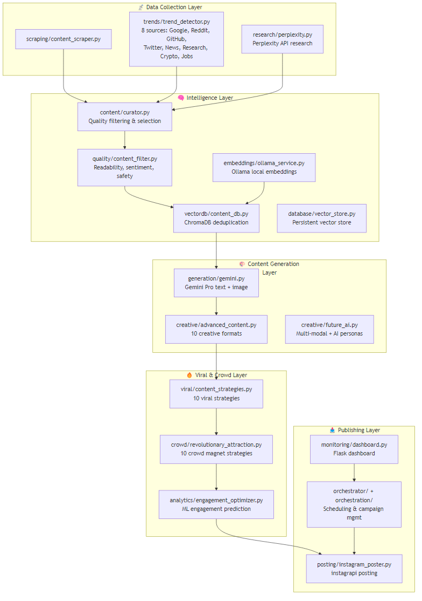
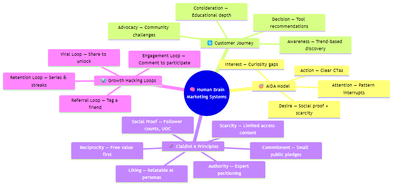
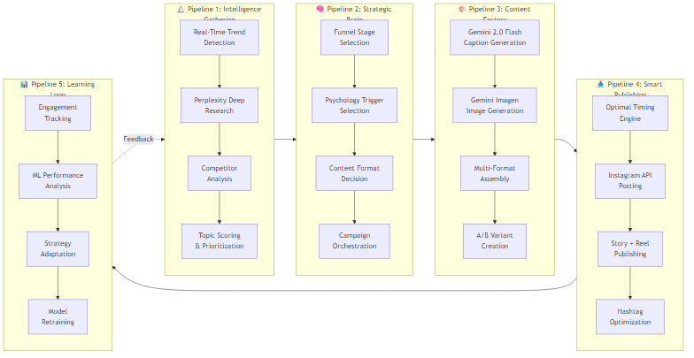

# 🚀 Ultimate Instagram AI Automation — Methodology & Implementation Plan

## 1. Project Overview & Current State

The **AUTOMATIC** project is a Python-based Instagram AI Content Automation System built for AI education content marketing. It scraped, generates, and posts AI-related content to Instagram using Gemini AI, with psychological crowd-attraction strategies.

### Current Architecture (23 modules in `src/`)

### Current Capabilities vs. Gaps

| Area | ✅ What Exists | ❌ What's Missing / Weak |
|------|---------------|-------------------------|
| **AI Generation** | Gemini Pro for captions, basic image prompts | Not using Gemini 2.0 Flash, no actual image generation API, text overlay only |
| **Research** | Perplexity API integration | No structured data enrichment, no competitor monitoring loop |
| **Trends** | 8 trend sources | Twitter mock implementation, no real-time trend scoring |
| **Viral Strategies** | 10 strategies defined in code | Template-based, not AI-driven; no A/B testing feedback loop |
| **Crowd Attraction** | 10 psychological triggers | Campaign designs not connected to actual posting; no user tracking |
| **Engagement ML** | RandomForest predictor | Not trained on real data; heuristic fallback only |
| **Creative Formats** | 10 formats (carousel, infographic, etc.) | No Gemini Imagen integration; PIL-based text overlays only |
| **Instagram Posting** | Photo, carousel, reel support | Currently in test mode (`_post_photo` just logs); no story/DM support |
| **Monitoring** | Flask dashboard | Minimal; no real-time analytics, no ROI tracking |
| **Testing** | 6 test files | Tests exist but no CI/CD pipeline |

---

## 2. The "Human Brain" Marketing & Sales Framework

> The goal: **Replicate the strategic thinking of top marketing & sales professionals** using AI automation.

### 2.1 Marketing Psychology Principles (The Human Brain)

Real marketing professionals use these cognitive frameworks — our system should too:

### 2.2 Sales Funnel Mapped to Instagram Content

| Funnel Stage | Content Type | Gemini AI Role | Posting Strategy |
|---|---|---|---|
| **TOFU** (Top of Funnel) | Viral hooks, shocking AI facts, memes | Generate attention-grabbing hooks | Reels + carousel; max reach |
| **MOFU** (Middle of Funnel) | Tutorials, comparisons, deep dives | Generate educational multi-part series | Carousels + story series; engagement |
| **BOFU** (Bottom of Funnel) | Tool reviews, career guides, exclusive access | Personalized recommendations | DMs + story polls; conversion |
| **Retention** | Community challenges, behind-scenes, gamification | Adaptive content based on user segments | Consistent series + interactive |

---

## 3. Methodology — The Advanced System Design

### 3.1 Core Architecture Upgrade — 5 Intelligent Pipelines

### 3.2 Gemini API — Full Integration Strategy

We will use the **Gemini API** as the central AI brain for multiple tasks:

| Gemini Capability | How We Use It | Module Impact |
|---|---|---|
| **Gemini 2.0 Flash** | Fast caption generation, hashtag optimization, CTA generation | `generation/gemini.py` — upgrade model |
| **Gemini with structured output** | JSON-structured content plans, campaign timelines | `orchestration/ultimate_master.py` — structured generation |
| **Gemini for content analysis** | Analyze competitor posts, score content quality via AI | `analytics/` — replace heuristic scoring |
| **Gemini function calling** | Trigger posting, schedule campaigns, research topics | `orchestrator/` — agentic workflow |
| **Gemini long context** | Feed trend data + past performance for strategy planning | `creative/future_ai.py` — context-aware generation |
| **Gemini vision** | Analyze image aesthetics, competitor visual strategies | New module: `vision/image_analyzer.py` |

---

## 4. Implementation Plan — 7 Phases

### Phase 1: Gemini API Upgrade 🔧
**Goal:** Upgrade from `gemini-pro` to `gemini-2.0-flash` with structured outputs

#### [MODIFY] gemini.py
- Upgrade model to `gemini-2.0-flash`
- Add structured JSON output for consistent caption/hashtag/CTA formatting
- Add Gemini-based image prompt generation for Imagen
- Add content analysis method using Gemini
- Add function-calling support for agentic workflows

#### [MODIFY] settings.py
- Update default model to `gemini-2.0-flash`
- Add new config for Gemini features (structured output schemas, safety settings)

---

### Phase 2: Marketing Intelligence Engine 📡
**Goal:** Build the "sales brain" that thinks like top marketers

#### [NEW] `src/marketing/sales_funnel.py`
- Implement AIDA model mapping for content
- TOFU/MOFU/BOFU content classification
- Automatic funnel-stage detection from trending topics
- Content-to-funnel recommendation engine

#### [NEW] `src/marketing/psychology_engine.py`
- Cialdini's 6 principles implementation
- Dynamic trigger selection based on audience segment
- Emotional hook generator using Gemini
- Curiosity gap creator for captions

#### [NEW] `src/marketing/growth_loops.py`
- Viral loop designer (share-to-unlock mechanics)
- Engagement loop automation (comment-to-win, poll-based)
- Retention loop with series & streak tracking
- Referral incentive system

---

### Phase 3: Advanced Content Factory 🎨
**Goal:** Generate studio-quality multi-format content

#### [MODIFY] advanced_content.py
- Integrate Gemini Imagen for real image generation (when available)
- Enhanced carousel generator with storytelling arc
- Data visualization generator with real trend data
- Meme generator using Gemini vision understanding

#### [MODIFY] content_strategies.py
- Replace template-based generation with Gemini dynamic generation
- Add A/B variant creation for each viral strategy
- Add content scoring before publishing (pre-flight check)

#### [NEW] `src/creative/storytelling.py`
- Multi-post narrative arc generator
- Series continuity tracker
- Cliffhanger and callback system
- Character/persona consistency engine

---

### Phase 4: Intelligent Engagement System 📊
**Goal:** Replace heuristic scoring with real ML + Gemini analysis

#### [MODIFY] engagement_optimizer.py
- Add Gemini-based engagement prediction (supplement RandomForest)
- Implement real-time content scoring
- A/B test result tracking and analysis
- Dynamic hashtag effectiveness scoring

#### [NEW] `src/analytics/ab_testing.py`
- Automatic A/B test creation for captions/images/timing
- Statistical significance calculator
- Winner auto-selection and strategy update
- Test history and learning database

#### [NEW] `src/analytics/audience_insights.py`
- Audience behavior pattern recognition
- Best time-to-post calculator from real engagement data
- Content preference mapping per audience segment
- Churn prediction and re-engagement triggers

---

### Phase 5: Smart Publishing Engine 📤
**Goal:** Full Instagram API integration with intelligent scheduling

#### [MODIFY] instagram_poster.py
- Remove test-mode logging, enable actual posting
- Add Story publishing support
- Add Reel publishing with auto-generated captions
- Add scheduling queue with retry logic
- Implement rate-limiting with human-behavior simulation

#### [NEW] `src/posting/content_calendar.py`
- Visual content calendar with funnel-stage mapping
- Campaign timeline management
- Cross-format scheduling (post → story → reel sequence)
- Gap detection and auto-fill

---

### Phase 6: Campaign Management System 🎯
**Goal:** Coordinated multi-day marketing campaigns

#### [MODIFY] ultimate_master.py
- Integrate marketing psychology engine
- Add campaign performance tracking with real metrics
- Implement adaptive campaign optimization (adjust mid-campaign)
- Add Gemini-powered campaign strategy generation

#### [NEW] `src/campaigns/campaign_manager.py`
- Named campaign creation and management
- Phase-based execution (launch → growth → sustain → wrap-up)
- Cross-campaign learning (what worked in campaign A → apply to B)
- Budget/resource tracking

---

### Phase 7: Learning & Optimization Loop 🔄
**Goal:** System gets smarter over time

#### [NEW] `src/learning/feedback_loop.py`
- Post-performance data collection pipeline
- Weekly strategy review automation
- Model retraining trigger based on data thresholds
- Performance report generation using Gemini

#### [MODIFY] dashboard.py
- Real-time analytics dashboard with charts
- Campaign ROI tracking
- Content performance heatmap
- Strategy recommendation panel

---

## 5. Verification Plan

### Automated Tests
- Run existing tests: `python tests/run_all_tests.py`
- New unit tests for marketing pipeline: `tests/test_marketing_engine.py`
- Integration test for Gemini structured output: `tests/test_gemini_integration.py`
- End-to-end campaign test: `tests/test_campaign_flow.py`

### Manual Verification
1. **Gemini API Test**: Run `python -c "from src.generation.gemini import GeminiContentGenerator; g = GeminiContentGenerator(); print(g.generate_post_content(...))"` to verify caption generation
2. **Campaign Flow**: Run `python run_ultimate_automation.py` and verify campaign creation and content generation in logs
3. **Dashboard**: Launch `python main.py dashboard` and verify at `http://localhost:5000`

---

## 6. Technology Stack Summary

| Layer | Current | Upgraded To |
|---|---|---|
| Primary AI | Gemini Pro | **Gemini 2.0 Flash** + structured output |
| Research AI | Perplexity `llama-3.1-sonar-huge-128k-online` | Same (excellent choice) |
| Embeddings | Ollama `nomic-embed-text` | Same + Gemini embeddings as fallback |
| Vector DB | ChromaDB | Same (sufficient for scale) |
| ML Prediction | scikit-learn RandomForest | Same + **Gemini-augmented scoring** |
| Image Generation | PIL text overlays | **Gemini Imagen** (when API available) |
| Instagram API | instagrapi | Same (mature library) |
| Dashboard | Flask (basic) | Flask + **Chart.js real-time analytics** |
| Scheduling | `schedule` library | Same + `APScheduler` for robustness |

---

## 7. Expected Impact After Implementation

| Metric | Current Capability | After Implementation |
|---|---|---|
| Content Quality | Template-based, generic | AI-driven, personalized per funnel stage |
| Viral Potential | Random strategy selection | Data-driven strategy + A/B testing |
| Posting Intelligence | Fixed schedule | ML-optimized timing + audience behavior |
| Campaign Coordination | Single-post focus | Multi-day coordinated campaigns |
| Learning Speed | No feedback loop | Continuous improvement every cycle |
| Marketing IQ | Technical content only | Full AIDA + Cialdini psychology |
| Image Quality | Text overlays | AI-generated visuals (Gemini Imagen) |
| Engagement Prediction | Heuristic guess | Trained ML + Gemini analysis |
